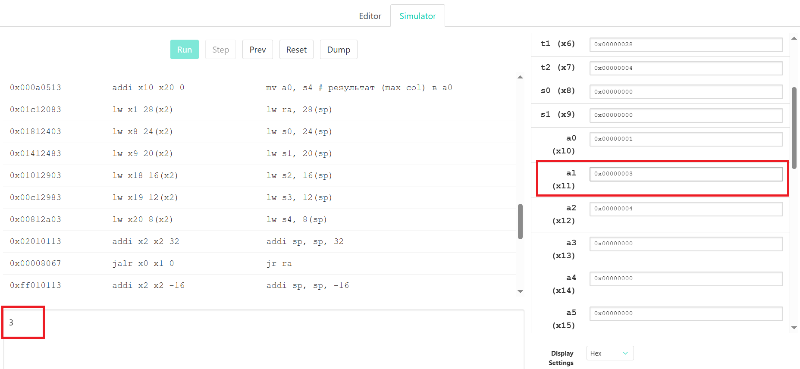
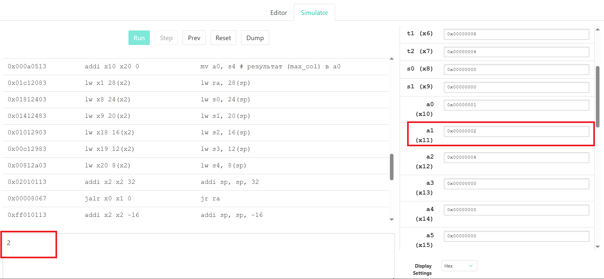

# Лабораторная работа 1. RISC‑V ASM + C

## Вариант задания

Найти столбец в матрице с максимальной суммой
элементов. (N = 4, M = 4)

## Структура проекта

```
├── 📁 asm_prog
│   └── 📄 main.asm
├── 📁 c_prog
│   └── 📄 main.c
│   ├── 📄 c_prog.out
│   ├── 📄 asm_prog.efi
│   ├── 📄 asm_prog.dump
├── 📄 Makefile
└── 📄 README.md
```
В 📁 asm_prog хранится исходный код на ассемблере RISC-V (📄 main.asm) для симулятора [Venus](https://venus.kvakil.me/).

В 📁 c_prog хранится все, что связано с Си, а именно исходный текст программы (📄 main.c), исполяемый файл (📄 c_prog.out), скомпилированный Си код под RISC-V (📄 asm_prog.efi) и дамп этого файла (📄 asm_prog.dump).

## Сборка
Для сборки Си в полностью настроенном окружении необходимо выполнить:
```
make
```
находясь в директории с `Makefile`. Автоматически будет выполнена очистка директорий и повторная сборка Си кода, включая исполянемый файл под основную систему, файл под RISC-V и дамп этого файла.

Для отчистки каталогов можно выполнить:
```
make clean
```
## Алгоритм на Си

### Описание

Функция `max_sum_col_index()` вычисляет сумму элементов каждого столбца матрицы и возвращает индекс столбца с максимальной суммой. Матрица хранится в памяти построчно (row-major order).

### Реализация

```c
int max_sum_col_index(int *a, int rows, int cols)
{
    int i, j;
    int max_col = 0;
    int max_sum = 0;
    int sum;

    for (j = 0; j < cols; j++) {
        sum = 0;
        for (i = 0; i < rows; i++) {
            sum = sum + a[i * cols + j];
        }
        if (j == 0 || sum > max_sum) {
            max_sum = sum;
            max_col = j;
        }
    }

    return max_col;
}


int main(void)
{
    int m[4][4] = {
        {  1,  2,  3,  4 },
        {  5,  6,  7,  8 },
        {  9, 10, 11, 12 },
        { 13, 14, 15, 16 }
    };

    int idx = max_sum_col_index(&m[0][0], 4, 4);

    printf("%d\n", idx);

    return 0;
}
```

### Тестовые прогоны (C)
На массиве:
```c
    int m[4][4] = {
        {  1,  2,  3,  4 },
        {  5,  6,  7,  8 },
        {  9, 10, 11, 12 },
        { 13, 14, 15, 16 }
    };
```
Запусти программу:
```
$ ./c_prog.out
3
```

**Пояснение**: столбцы имеют суммы 28, 32, 36, 40. Максимальная сумма 40 в столбце с индексом 3.

Обновим массив:
```c
int m[4][4] = {
    { -34,  12,  45, -8 },
    {  23, -49,   0, 17 },
    { -15,  38, -22,  5 },
    {  50, -41,  29, -6 }
};
```
Запусти программу:
```
$ ./c_prog.out
2
```

**Пояснение**: столбцы имеют суммы 24, -40, 52, 8. Максимальная сумма 52 в столбце с индексом 2.
## Алгоритм на ассемблере RISC-V

### Описание

Реализация на RISC-V следует той же логике с двумя вложенными циклами. Функция сохраняет на стек используемые регистры s0–s4 (callee-saved), передает параметры через a0–a2 и возвращает результат в a0.

**Регистры:**
- `s0`: указатель на матрицу
- `s1`: количество строк
- `s2`: количество столбцов
- `s3`: максимальная найденная сумма
- `s4`: индекс столбца с максимальной суммой
- `t0`: счетчик столбцов (j)
- `t1`: текущая сумма (sum)
- `t2`: счетчик строк (i)

### Реализация

```asm
    .data
matrix:     # 4х4
    .word 1, 2, 3, 4
    .word 5, 6, 7, 8
    .word 9, 10, 11, 12
    .word 13, 14, 15, 16

    .text
    .globl main

max_sum_col_index:
    addi sp, sp, -32    # Выделяем 32 байта на стек
    sw ra, 28(sp)       # сохраняем ra
    sw s0, 24(sp)       # сохраняем s0
    sw s1, 20(sp)       # сохраняем s1
    sw s2, 16(sp)       # сохраняем s2
    sw s3, 12(sp)       # сохраняем s3
    sw s4, 8(sp)        # сохраняем s4

    mv s0, a0           # s0 = a (указатель)
    mv s1, a1           # s1 = rows
    mv s2, a2           # s2 = cols
    li s3, 0            # s3 = max_sum
    li s4, 0            # s4 = max_col

    li t0, 0            # j = 0

col_loop:
    bge t0, s2, col_end # if j >= cols, выходим

    li t1, 0            # sum = 0
    li t2, 0            # i = 0

row_loop:
    bge t2, s1, row_end # if i >= rows, конец по строкам

    # адрес a[i*cols + j]:
    mul t3, t2, s2      # t3 = i * cols
    add t3, t3, t0      # t3 = i * cols + j
    slli t3, t3, 2      # t3 = (i*cols + j)*4
    add t4, s0, t3      # t4 = &a[i*cols + j]
    lw t5, 0(t4)        # t5 = a[i*cols + j]

    add t1, t1, t5      # sum += a[i*cols + j]
    addi t2, t2, 1      # i++
    j row_loop
row_end:

    # if (j == 0 || sum > max_sum)
    bnez t0, check_sum  # если j != 0
    mv s3, t1           # max_sum = sum
    mv s4, t0           # max_col = j
    j next_col
check_sum:
    ble t1, s3, next_col
    mv s3, t1           # max_sum = sum
    mv s4, t0           # max_col = j

next_col:
    addi t0, t0, 1      # j++
    j col_loop

col_end:
    mv a0, s4           # результат (max_col) в a0

    lw ra, 28(sp)
    lw s0, 24(sp)
    lw s1, 20(sp)
    lw s2, 16(sp)
    lw s3, 12(sp)
    lw s4, 8(sp)
    addi sp, sp, 32
    jr ra

# int main(void)
main:
    addi sp, sp, -16
    sw ra, 12(sp)

    la a0, matrix   # a0 = &matrix[0][0]
    li a1, 4        # rows = 4
    li a2, 4        # cols = 4
    call max_sum_col_index

    lw ra, 12(sp)
    addi sp, sp, 16
    
    mv a1, a0       
    li a0, 1        # file descriptor = 1 (stdout)
    li a7, 10       # exit
    ecall

```

### Тестовые прогоны (ASM в Venus)

После выполнения в симулторе:
```
3
```


Обновим массив:
```asm
    .word -34,  12,  45, -8
    .word  23, -49,   0, 17
    .word -15,  38, -22,  5
    .word  50, -41,  29, -6
```
После выполнения в симулторе:
```
2
```


## Анализ objdump
Компилятор RISC-V генерирует две функции: `max_sum_col_index` для основной логики и `main` для инициализации и вывода. Оба используют frame pointer и следуют стандартному ABI.

---

### Функция max_sum_col_index (0x10140–0x10218)

**Пролог со сбережением регистров:**
```
00010140 <max_sum_col_index>:
   10140:	fc010113          	addi sp,sp,-64      # выделение 64 байт на стеке
   10144:	02112e23          	sw ra,60(sp)        # сохранение адреса возврата
   10148:	02812c23          	sw s0,56(sp)        # сохранение frame pointer
   1014c:	04010413          	addi s0,sp,64       # инициализация нового frame pointer
```

Функция выделяет 64 байта на стеке и сохраняет критические регистры. Frame pointer (s0) используется для доступа к локальным переменным через отрицательные смещения: `[s0-20]` для `i`, `[s0-24]` для `j`, `[s0-28]` для `max_col`, `[s0-32]` для `max_sum`, `[s0-36]` для `sum`.

**Инициализация параметров:**
```
   10150:	fca42623          	sw	a0,-52(s0)      # сохранение указателя матрицы
   10154:	fcb42423          	sw	a1,-56(s0)      # сохранение rows
   10158:	fcc42223          	sw	a2,-60(s0)      # сохранение cols
   1015c:	fe042223          	sw	zero,-28(s0)    # max_col = 0
   10160:	fe042023          	sw	zero,-32(s0)    # max_sum = 0
   10164:	fe042423          	sw	zero,-24(s0)    # j = 0
```

**Внутренний цикл с вычислением адреса элемента:**
```
   10178:	fc442583          	lw	a1,-60(s0)      # a1 = cols (загрузка из памяти)
   1017c:	fec42503          	lw	a0,-20(s0)      # a0 = i
   10180:	110000ef          	jal	ra,10290        # вызов __mulsi3 (умножение i * cols)
   10190:	00f707b3          	add	a5,a4,a5        # a5 = i*cols + j
   10194:	00279793          	slli a5,a5,0x2      # a5 *= 4 (преобразование в байты)
   1019c:	00f707b3          	add	a5,a4,a5        # a5 = адрес элемента &a[i*cols+j]
   101a0:	0007a783          	lw	a5,0(a5)        # загрузка значения элемента
   101a8:	00f707b3          	add	a5,a4,a5        # добавление к sum
```

Компилятор использует вызов `__mulsi3` вместо встроенной инструкции (RV32I не имеет умножения).

**Условный переход (loop-back) с отрицательным смещением:**
```
   101b4:	00178793          	addi a5,a5,1        # i++
   101b8:	fef42623          	sw	a5,-20(s0)
   101c4:	faf74ae3          	blt	a4,a5,10178     # if (i < rows) прыжок НАЗАД на 0x10178
```

Отрицательное шестнадцатеричное смещение `faf74ae3` (в двоичном виде указывает на отрицательное значение) реализует возврат к началу цикла.

**Сравнение и обновление максимума:**
```
   101cc:	00078863          	beqz a5,101dc       # if (j == 0) инициализировать
   101d8:	00e7da63          	bge	a5,a4,101ec     # if (max_sum >= sum) пропустить обновление
   101dc:	fef42023          	sw	a5,-32(s0)      # max_sum = sum
   101e8:	fef42223          	sw	a5,-28(s0)      # max_col = j
```

**Эпилог с восстановлением регистров:**
```
   10204:	fe442783          	lw	a5,-28(s0)      # a5 = max_col
   10208:	00078513          	mv	a0,a5           # перемещение результата в a0 (возвращаемое значение)
   1020c:	03c12083          	lw	ra,60(sp)       # восстановление ra
   10210:	03812403          	lw	s0,56(sp)       # восстановление s0
   10214:	04010113          	addi sp,sp,64       # освобождение стека
   10218:	00008067          	ret                 # возврат из функции
```

---

### Функция main (0x1021c–0x1028c)

**Пролог и подготовка локальной матрицы:**
```
0001021c <main>:
   1021c:	fa010113          	addi	sp,sp,-96    # выделение 96 байт на стеке
   10220:	04112e23          	sw	ra,92(sp)        # сохранение ra
   10224:	04812c23          	sw	s0,88(sp)        # сохранение s0
   1022c:	000257b7          	lui	a5,0x25          # загрузка верхних 20 бит адреса матрицы
   10230:	74478713          	addi	a4,a5,1860   # полная адреса глобальной матрицы в памяти данных
   1024c:	12c000ef          	jal	ra,10378         # вызов memcpy для копирования матрицы на стек
```

Матрица копируется из памяти данных на стек через `memcpy`.

**Передача параметров и вызов max_sum_col_index:**
```
   10250:	fac40793          	addi a5,s0,-84      # a5 = адрес локальной матрицы
   10254:	00400613          	li	a2,4            # a2 = cols = 4
   10258:	00400593          	li	a1,4            # a1 = rows = 4
   1025c:	00078513          	mv	a0,a5           # a0 = адрес матрицы
   10260:	ee1ff0ef          	jal	ra,10140        # вызов max_sum_col_index(matrix, 4, 4)
```

**Вызов printf с результатом:**
```
   10264:	fea42623          	sw	a0,-20(s0)      # сохранение результата (max_col) на стек
   10268:	fec42583          	lw	a1,-20(s0)      # a1 = max_col (второй параметр printf)
   1026c:	000257b7          	lui	a5,0x25         # загрузка верхних бит адреса строки формата "%d\n"
   10270:	74078513          	addi a0,a5,1856     # a0 = полный адрес строки формата
   10274:	33c000ef          	jal	ra,105b0        # вызов printf("%d\n", max_col)
```

Результат передается в `printf` через регистры a0 (формат `"%d\n"`) и a1 (значение).

**Эпилог:**
```
   10278:	00000793          	li	a5,0            # a5 = 0 (return 0)
   1027c:	00078513          	mv	a0,a5           # a0 = 0 (возвращаемое значение main)
   10280:	05c12083          	lw	ra,92(sp)
   10284:	05812403          	lw	s0,88(sp)
   10288:	06010113          	addi sp,sp,96
   1028c:	00008067          	ret
```

---

### Ключевые моменты

1. **Сохранение регистров:** каждая функция сохраняет ra и s0 на стеке в прологе, восстанавливает в эпилоге
2. **Frame pointer:** доступ к локальным переменным через отрицательные смещения от s0
3. **Loop-back переходы:** отрицательные смещения в `blt` реализуют циклы
4. **Заполненные адреса:** вызовы функций используют конкретные адреса (0x10140 для max_sum_col_index, 0x105b0 для printf, 0x10378 для memcpy)
5. **Двухшаговая загрузка адресов:** `lui` + `addi` используются для доступа к глобальным данным из памяти .data

**Примечание:** в полном дампе присутствует значительный объем служебного кода (prologue библиотеки, __libc_init_array, memset и другие функции runtime), но основная логика сосредоточена в max_sum_col_index и main.

